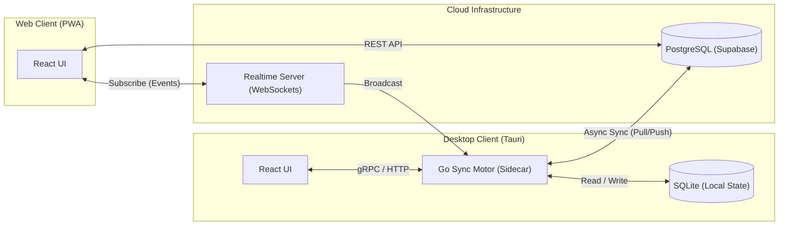

# Taskify - Local-First Architecture & Realtime Synchronization

## 📖 Executive Summary

Taskify is an operational management system built under the **Local-First** paradigm.

The platform addresses network latency, intermittent connectivity, and data-loss challenges by prioritizing local persistence and offline operation.

Key characteristics:

- ✅ 100% offline availability.
- ✅ Local-first data ownership.
- ✅ Bidirectional asynchronous synchronization.
- ✅ Eventual consistency across multiple clients.
- ✅ Realtime updates through WebSockets.
- ✅ Cross-platform support (Desktop + PWA).

The system maintains a local source of truth and synchronizes state with cloud infrastructure whenever connectivity becomes available.

---

# 🏗️ System Architecture

Taskify uses a hybrid architecture:

- **Desktop Application:** Sidecar Pattern
- **Web Application (PWA):** Traditional Client-Server Architecture

## Technology Stack

| Layer | Technology |
|---------|------------|
| Frontend | React + TypeScript + Vite |
| UI Components | Tailwind CSS + shadcn/ui |
| Desktop Host | Tauri (Rust) |
| Synchronization Engine | Go (Golang) |
| Local Database | SQLite |
| Cloud Database | PostgreSQL (Supabase) |
| Realtime Layer | Supabase Realtime (WebSockets) |

---

## Architecture Diagram



---

# 🔄 Synchronization Flow

```text
┌─────────────┐
│ React UI    │
└──────┬──────┘
       │
       ▼
┌─────────────┐
│ Go Sidecar  │
└──────┬──────┘
       │
       ▼
┌─────────────┐
│ SQLite      │
└──────┬──────┘
       │
       │ Sync when online
       ▼
┌─────────────┐
│ PostgreSQL  │
│ Supabase    │
└──────┬──────┘
       │
       ▼
┌─────────────┐
│ Realtime WS │
└─────────────┘
```

---

# 📐 Architectural Decision Records (ADRs)

## ADR-001: Conflict Resolution Strategy (Last Write Wins)

### Context

In a Local-First environment, multiple clients may modify the same entity while disconnected from the network.

### Decision

Implement a **Last Write Wins (LWW)** conflict resolution strategy using UTC timestamps (`updated_at`).

### Benefits

- Simple implementation.
- Predictable synchronization behavior.
- High availability.
- Better user experience during offline operation.

### Trade-off

The system favors:

- Availability
- Responsiveness
- Offline operation

over:

- Immediate strong consistency
- Distributed transaction coordination

---

## ADR-002: Soft Deletes for Synchronization Integrity

### Context

Physical deletions (`DELETE`) generated synchronization race conditions because removed records left no synchronization trail.

### Decision

Replace hard deletes with logical deletions using:

```sql
deleted_at TIMESTAMP NULL
```

### Benefits

- Deterministic synchronization.
- Full auditability.
- Historical recovery.
- Simplified conflict resolution.

### Consequences

All domain queries must filter logically deleted records.

---

## ADR-003: Production Credential Isolation

### Context

Desktop binaries distribute executable code directly to end users.

Exposing infrastructure credentials inside the application package creates significant security risks.

### Decision

Avoid shipping static environment secrets.

Configuration is injected securely during the build and deployment process.

### Benefits

- Reduced attack surface.
- Safer enterprise deployments.
- Better secret management practices.

### Operational Rule

- `frontend/.env` must contain only public client variables.
- Privileged credentials such as `REMOTE_DB_URL`, `JWT_SECRET`, and `SUPABASE_SERVICE_ROLE_KEY` must live only in backend/runtime secret stores.
- Developers should create local `.env` files from the tracked `.env.example` templates; real `.env` files must stay untracked.
- Desktop Tauri builds must use `REMOTE_API_URL` for cloud synchronization and must not embed direct database credentials inside the executable.

---

# 🔐 Security

## Row Level Security (RLS)

The cloud database uses PostgreSQL Row Level Security policies to guarantee tenant isolation.

Features:

- JWT-based authentication.
- Tenant-aware authorization.
- Secure realtime subscriptions.
- Data isolation between organizations.

---

## Realtime Security

WebSocket payloads are protected through authenticated Supabase channels.

Security goals:

- Prevent unauthorized subscriptions.
- Prevent tenant data leakage.
- Maintain end-to-end authorization enforcement.

---

# 🎨 User Experience (UX)

The user interface follows established usability principles inspired by Nielsen's heuristics.

### Design Goals

- Immediate feedback.
- Offline visibility.
- Synchronization transparency.
- Responsive interactions.
- Minimal user disruption.

### Examples

- Network status indicators.
- Synchronization progress feedback.
- Automatic reconnection handling.
- Light/Dark theme transitions.
- Optimistic UI updates.

---

# ⚡ Key Quality Attributes

| Attribute | Strategy |
|------------|-----------|
| Availability | Local SQLite persistence |
| Reliability | Asynchronous synchronization |
| Performance | Local reads and writes |
| Scalability | Event-driven synchronization |
| Security | RLS + JWT |
| Maintainability | Sidecar architecture |
| Portability | Tauri Desktop + PWA |
| Usability | Offline-first UX |

---

# 🚀 Build & Deployment Guide

## Prerequisites

### Node.js

```bash
>= 18.x
```

### Go

```bash
>= 1.21
```

### Rust

Required for:

- Cargo
- Tauri

Install from:

https://www.rust-lang.org/tools/install

---

# 🖥️ Production Build (Windows x64)

The current build process uses a manual pipeline (pre-CI/CD).

Goals:

- Optimize executable size.
- Hide sidecar terminal window.
- Improve startup performance.

---

## Step 1: Build the Go Synchronization Engine

```bash
cd backend

go build \
  -trimpath \
  -ldflags="-H windowsgui -s -w" \
  -o ../frontend/src-tauri/bin/backend-x86_64-pc-windows-msvc.exe \
  ./cmd
```

### Flags Explained

| Flag | Purpose |
|--------|----------|
| `-H windowsgui` | Hides console window |
| `-s` | Removes symbol table |
| `-w` | Removes debug information |
| `-trimpath` | Removes local filesystem paths from build metadata |

The automated desktop build already uses these release flags through `frontend/package.json`.

---

## Step 2: Package Desktop Application

```bash
cd ../frontend

npm install

npm run tauri build
```

Generated artifacts:

```text
frontend/src-tauri/target/release/bundle/
```

---

# Desktop Release Hardening

## What is already hardened

- Desktop sync uses `REMOTE_API_URL`; it no longer connects directly to remote Postgres.
- Remote sync tokens are stored in the operating system keychain through Tauri, not in desktop `localStorage`.
- Desktop logout clears the secure session, clears the local sync session, and purges the local SQLite data store.
- The Tauri webview capability no longer exposes generic shell execution permissions.
- The Go sidecar release build hides the terminal window and strips debug-heavy metadata.

## Release Checklist

1. Secrets and configuration
   - Verify `frontend/.env` contains only public values.
   - Verify desktop build environment sets `REMOTE_API_URL` to the production backend URL.
   - Verify Render production environment contains `JWT_SECRET`, `SUPABASE_SERVICE_ROLE_KEY`, and any database credentials only on the server side.
   - Verify Supabase keys rotated during phase 1 are the only active ones.

2. Backend and sync
   - Confirm `/sync/push` and `/sync/pull` are deployed on Render.
   - Confirm JWT auth is required for both endpoints.
   - Confirm remote CORS allows the desktop local origin flow already used by the app.
   - Confirm a real user can login on desktop, create a task offline, reconnect, and see it appear on web.

3. Desktop executable
   - Run `npm run tauri:build` from `frontend`.
   - Install the generated `.msi` or `.exe` from `frontend/src-tauri/target/release/bundle/`.
   - Verify the app starts without a visible sidecar console window.
   - Verify window dragging, maximize, minimize, and close still work.
   - Verify desktop relaunch restores the session from the OS keychain.
   - Verify logout returns to an empty local state after restart.

4. Data safety
   - Export a backup from the desktop app and verify the SQLite file opens.
   - Verify purge on logout does not delete files outside the Taskify app data folder.
   - Verify avatar selection and local backup export still work in release mode.

5. Distribution
   - Verify app icon, product name, and version are correct in the installer.
   - Code-sign the Windows installer/executable if you plan external distribution.
   - Run one clean install test on a machine that never had Taskify installed.

6. Final smoke test
   - Desktop login
   - Create/edit/delete data
   - Sync to web
   - Web change syncs back to desktop
   - Restart desktop
   - Logout
   - Login as another user on the same machine

---

# 📦 Deployment Targets

- Windows Desktop (.msi)
- Windows Desktop (.exe)
- Progressive Web App (PWA)

Future targets:

- macOS
- Linux
- Self-hosted synchronization backend

---

# 🌟 Core Features

- Local-First Architecture
- Offline Operation
- Realtime Synchronization
- SQLite Local Database
- PostgreSQL Cloud Database
- WebSocket Updates
- Desktop Application (Tauri)
- Progressive Web App (PWA)
- Multi-Client Synchronization
- Eventual Consistency
- Conflict Resolution (LWW)
- Soft Delete Synchronization
- JWT Authentication
- Row Level Security (RLS)

---

# 📄 License

This project is distributed under the terms defined in the repository license.
